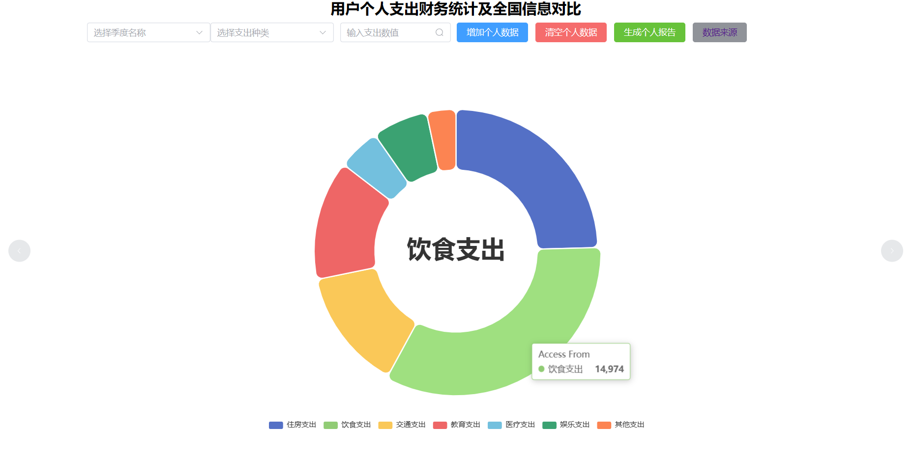
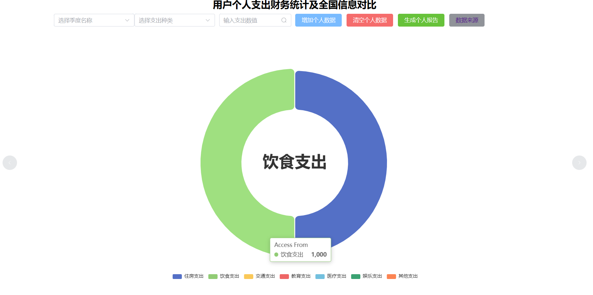
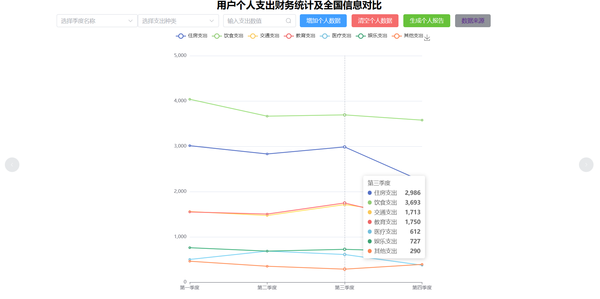
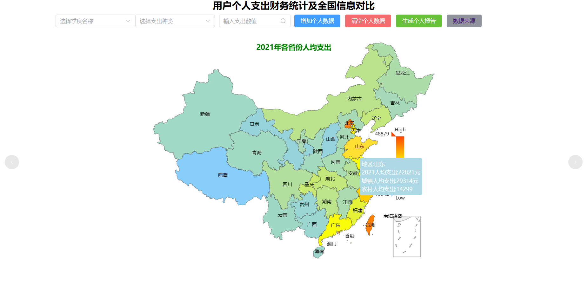
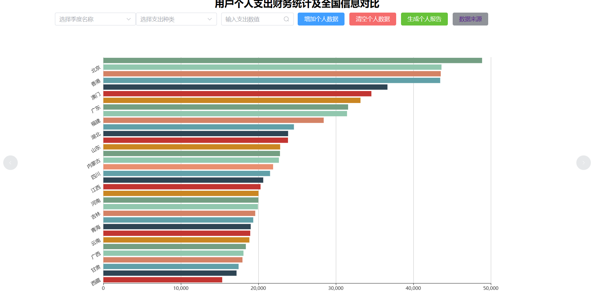
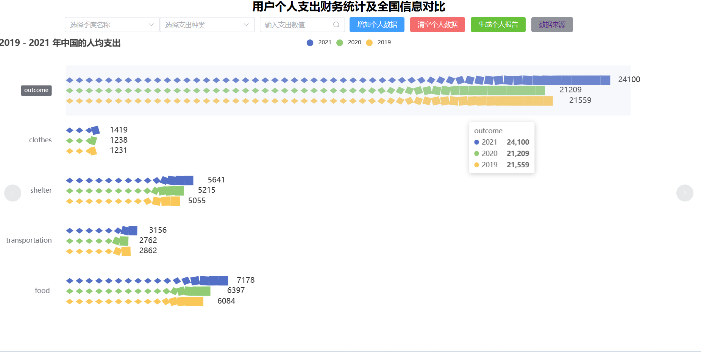
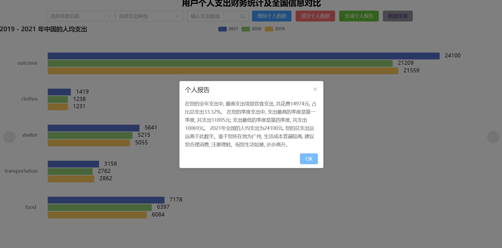

# DataVisDesign

## 如何使用

本地运行(需要nodejs环境)

```shell
npm install
npm run dev
```

在线浏览

http://02clannad.cf:9527/

## 分工

数据可视化小组大作业,四人共同完成,共计四副图表

成员 gmy ljx st sly

## 简介

  该项目可以与用户的进行动态交互，来对用户的全年、不同季度的支出情况进行统计，同时对比全国的数据，来分析用户的支出情况，试图多角度全方位的来对用户的支出情况进行综合性的分析，以便用户更好的了解自身的支出情况，对生活产生一定的帮助。

  对于前两幅图表，支持动态的加入数据，清空数据，生成报告；用饼状图的形式分析不同类型支出在总支出的占比；用不同季度折线图的形式，来分析不同支出在不同季度上的变化情况。

  对于第三幅图表，数据来源于2021年中国各省市农村与城镇居民人均年支出。使用中国地图在每个省市板块上面显示人均年支出效果会很好，可以观察到地处位置对人均年支出的影响，同时在同一省市下显示出人均年支出，城镇人均年支出和农村人均年支出具有鲜明对比性，信息展示更加全面。使用动画转换成直方图，用于直观表示各省市人均年收入的比较。

  对于第四幅图表，数据来源于2019-2021国民经济运行情况新闻发布会，展示了总人均支出和衣食住行这四个主要方面的支出，不同类型支出采用不同样式的图标，利用柱状图到图片柱图再到象形柱图的动画方式，较为直观的展现不同年份之间以及不同类型之间支出的比较数据。

  项目技术栈vue+echarts

## 部分展示

图一

已有数据



支持用户增加数据，清空数据



图二



图三-1

地图到柱状图切换



图三-2



图四

动态柱形图



同时根据个人数据，生成个人报告


